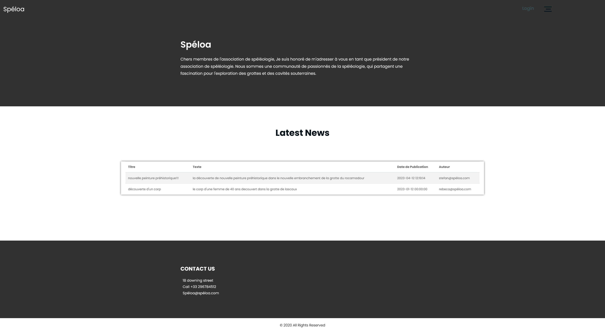
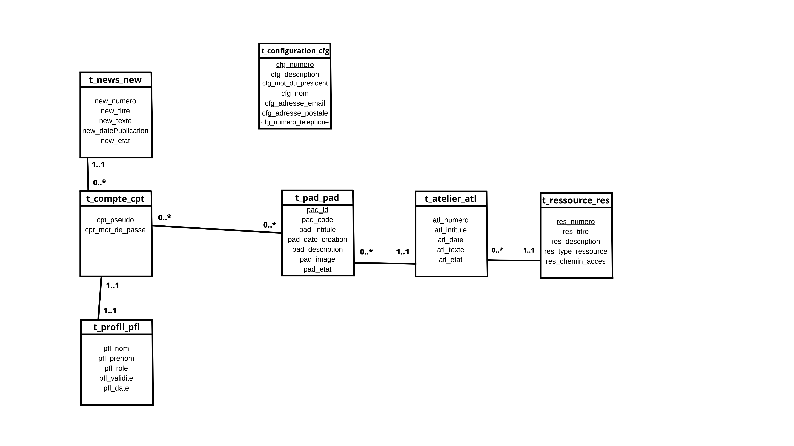
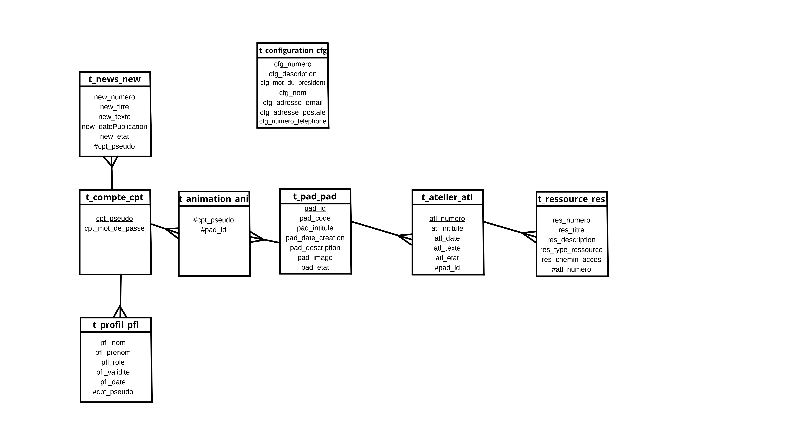

# Spéloa Application Web en php,html,css,js,sql

Application permettant le partage d'activités et de ressources.
Les animateurs peuvent créer des activités (pads) et ajouter des ressources. Les personnes ayant reçu le code peuvent consulter l'activité grâce à pad.php?code=XXXX.
Gestion CRUD des comptes, des pads et des documents.

### Capture d'écran : 



### Acquis :

- **Création de diagramme UML et conception de base de données :**

    

    
    
    ```sql
    
    CREATE TABLE `t_atelier_atl` (
    `atl_numero` int(10) NOT NULL,
    `atl_intitule` varchar(100) NOT NULL,
  `atl_date` datetime DEFAULT NULL,
  `atl_texte` varchar(512) NOT NULL,
  `atl_etat` char(1) NOT NULL,
  `pad_id` int(10) NOT NULL
    ) ENGINE=InnoDB DEFAULT CHARSET=utf8mb4;

    CREATE TABLE `t_compte_cpt` (
  `cpt_pseudo` varchar(60) NOT NULL,
  `cpt_mot_de_passe` char(32) NOT NULL
    ) ENGINE=InnoDB DEFAULT CHARSET=utf8mb4;

    ```

- **Utilisation de base de données et de requete sql :**
    ```php
    <div class="container">
         <div class="about_taital_main">
            <h2 class="about_tag">
               <?php
               $mysqli = new mysqli('localhost', 'name', '*********', 'zfl2-zrousvaro_1'); // connection base de données
               if ($mysqli->connect_errno) { // verification erreur
                  echo "Error: Problème de connexion à la BDD \n";
                  echo "Errno: " . $mysqli->connect_errno . "\n";
                  echo "Error: " . $mysqli->connect_error . "\n";
               }
               if (!$mysqli->set_charset("utf8")) { // verification erreur
                  printf("Pb de chargement du jeu de car. utf8 : %s\n", $mysqli->error);
               }
               $requetetoutconfig = "SELECT * FROM t_configuration_cfg;"; // recupère toute les informations de la table configuration
               $resulttoutconfig = $mysqli->query($requetetoutconfig); // execute la requete
               if ($resulttoutconfig == false) { // verification erreur
                  echo "Error: La requête a echoué \n";
                  echo "Errno: " . $mysqli->errno . "\n";
                  echo "Error: " . $mysqli->error . "\n";
               } else {
                  $config = $resulttoutconfig->fetch_assoc(); // crée le tableaux associatif du résultat de la requete
                  echo ($config['cfg_nom']); // affiche le nom de l'association
               }
               ?>
            </h2>
            <div class='about_menu' style='margin-bottom:1em;'>
               <ul>
                  <li>
                     <?php echo $config['cfg_mot_du_president'] ?> <!-- affiche le nom de l'association -->
                  </li>
               </ul>
            </div>
         </div>
      </div>

    ```

- **Utilisation de bootstrap :**
    ```html
    <div class="header_section">
      <div class="container-fluid">
         <div class="main">
            <div class="logo">
               <a href="index.php" style=" color:#fff;">
                  <h1 style="font-size:2em;color:#fff; ">Spéloa</h1>
               </a>
            </div>
            <div class="menu_text">
               <ul>
                  <div class="togle_">
                     <div class="menu_main">
                        <ul>
                           <li><a href="session.php">Login</a></li>
                           <li><a href="#"><i class="fa fa-search" aria-hidden="true"></i></a></li>
                        </ul>
                     </div>
                  </div>
                  <div id="myNav" class="overlay">
                     <a href="javascript:void(0)" class="closebtn" onclick="closeNav()">&times;</a>
                     <div class="overlay-content">
                        <a href="index.php">Home</a>
                        <a href="animation.php">Animation</a>
                        <a href="inscription.php">Inscription</a>
                        <a href="session.php">Login</a>
                     </div>
                  </div>
                  <span class="navbar-toggler-icon"></span>
                  <span onclick="openNav()"></span>
                  <span onclick="openNav()"></span>
               </ul>
            </div>
         </div>
      </div>

    ```
